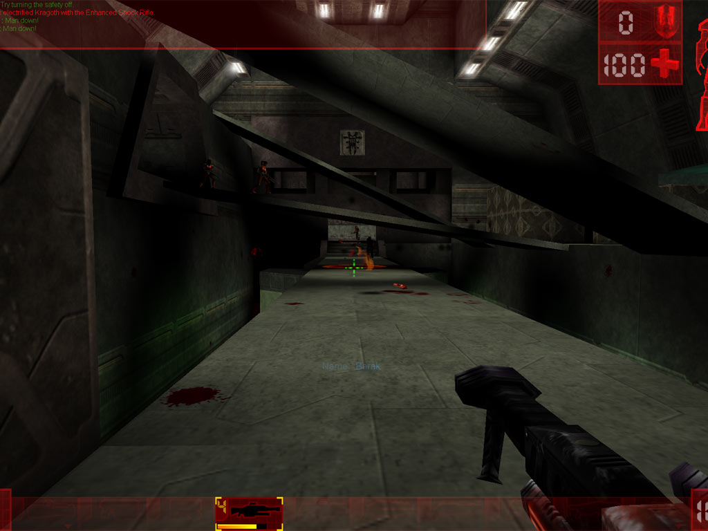

# Unreal Tournament (1999) Dedicated Server in Docker

Unreal Tournament is an arena first-person shooter first published in 1999, with head-to-head multiplayer deathmatches being the primary focus of the game. "Mutators" are available which drastically alter gameplay aspects, such as "InstaGib", the use of which makes players compete with instant-kill weapons instead of the normal ones.



This repository is maintained by [Laclede's LAN](https://lacledeslan.com). Its contents are intended to be bare-bones and used as a stock server. For an example of building a customized server from this Docker image browse the related child-project [gamesvr-ut99-freeplay](https://github.com/LacledesLAN/gamesvr-ut99-freeplay). If any documentation is unclear or it has any issues please see [CONTRIBUTING.md](./CONTRIBUTING.md)

This UT99 server was built from the following content:

1. Official Unreal Tournament 99 Server - Version 436.
2. Epic Bonus Pack (a.k.a. Bonus Pack 1): Includes three new models (Skaarj Hybrid, Nali and Nali Warcow), the Relics and 11 new maps: CTF-Cybrosis][, CTF-Darji16, CTF-Hydro16, CTF-Noxion16, DM-Agony, DM-ArcaneTemple, DM-CybrosisII, DM-HealPodII, DM-Malevolence, DM-MojoII and DM-ShrapnelII.
3. DE Bonus Pack (a.k.a. Bonus Pack 2): Contains three new mutators (Team Beacon, Volatile Ammo and Volatile Weapon) and two new maps: CTF-HallOfGiants and CTF-Orbital.
4. Inoxx Bonus Pack (a.k.a. Bonus Pack 3): Contains six new maps: CTF-Face][, CTF-High, CTF-Kosov, CTF-Nucleus, DM-Crane and DM-SpaceNoxx.
5. Christmas Bonus Pack (a.k.a. Bonus Pack 4): Includes two new models (Warboss and Xan Mk. II) and 12 new maps: CTF-Beatitude, CTF-EpicBoy, CTF-Face-SE, CTF-Ratchet, DM-Bishop, DM-Closer, DM-Grit-TOURNEY, DM-Viridian-TOURNEY, DOM-Bullet, DOM-CiDom, DOM-Lament][ and DOM-WolfsBay.
6. UTPG community patch - version 451.

## Linux

[](https://github.com/LacledesLAN/gamesvr-ut99/actions/workflows/build-linux-image.yml)

### Download

```shell
docker pull lacledeslan/gamesvr-ut99;
```

### Run Self Tests

The image includes a test script that can be used to verify its contents. No changes or pull-requests will be accepted to this repository if any tests fail.

docker run -it --rm lacledeslan/gamesvr-ut99:latest /app/ll-tests/gamesvr-ut99.sh;

### Run simple interactive server

```shell
docker run -it --rm --net=host /app/ucc server DM-Deck16][.unr?Game=Botpack.DeathMatchPlus -nohomedir -lanplay;
```

## Getting Started with Game Servers in Docker

[Docker](https://docs.docker.com/) is an open-source project that bundles applications into lightweight, portable, self-sufficient containers. For a crash course on running Dockerized game servers check out [Using Docker for Game Servers](https://github.com/LacledesLAN/README.1ST/blob/master/GameServers/DockerAndGameServers.md). For tips, tricks, and recommended tools for working with Laclede's LAN Dockerized game server repos see the guide for [Working with our Game Server Repos](https://github.com/LacledesLAN/README.1ST/blob/master/GameServers/WorkingWithOurRepos.md). You can also browse all of our other Dockerized game servers: [Laclede's LAN Game Servers Directory](https://github.com/LacledesLAN/README.1ST/tree/master/GameServers).
